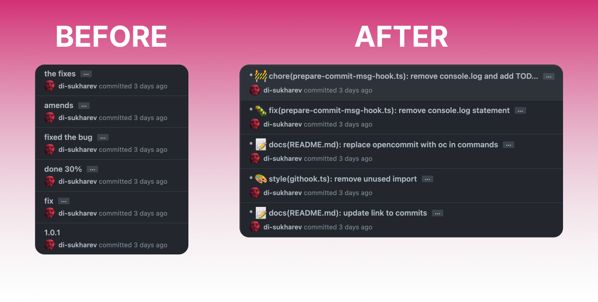

<div align="center">
  <div>
    
    <h1 align="center">Zi OpenCommit</h1>
  </div>
	<h2>GPT CLI to auto-generate impressive commits in 1 second</h2>
	<p>Killing lame commits with AI 🤯🔫</p>
	<a href="https://www.npmjs.com/package/ziopencommit"></a>
</div>

---

<div align="center">
    
</div>

All the commits in this repo are done with Zi OpenCommit — look into [the commits](https://github.com/di-sukharev/opencommit/commit/eae7618d575ee8d2e9fff5de56da79d40c4bc5fc) to see how Zi OpenCommit works. Emoji and long commit description text is configurable.

## Setup

1. Install Zi OpenCommit globally to use in any repository:

   ```sh
   npm install -g ziopencommit
   ```

2. Get your API key from [OpenAI](https://platform.openai.com/account/api-keys). Make sure you add payment details, so API works.

3. Set the key to Zi OpenCommit config:

   ```sh
   ziopencommit config set OPENAI_API_KEY=<your_api_key>
   ```

   Your api key is stored locally in `~/.ziopencommit` config file.

## Usage

You can call Zi OpenCommit directly to generate a commit message for your staged changes:

```sh
git add <files...>
ziopencommit
```

You can also use the `oc` shortcut:

```sh
git add <files...>
zc
```

## Features

### Preface commits with emoji 🤠

[GitMoji](https://gitmoji.dev/) convention is used.

To add emoji:

```sh
zc config set emoji=true
```

To remove emoji:

```sh
zc config set emoji=false
```

### Postface commits with descriptions of changes

To add descriptions:

```sh
zc config set description=true
```

To remove description:

```sh
zc config set description=false
```

### Internationalization support

To specify the language used to generate commit messages:

```sh
# de, German ,Deutsch
zc config set language=de
zc config set language=German
zc config set language=Deutsch

# fr, French, française
zc config set language=fr
zc config set language=French
zc config set language=française
```

The default language set is **English**  
All available languages are currently listed in the [i18n](https://github.com/faozimipa/ziopencommit/tree/main/src/i18n) folder

### Git flags

The `ziopencommit` or `zc` commands can be used in place of the `git commit -m "${generatedMessage}"` command. This means that any regular flags that are used with the `git commit` command will also be applied when using `ziopencommit` or `zc`.

```sh
zc --no-verify
```

is translated to :

```sh
git commit -m "${generatedMessage}" --no-verify
```

### Ignore files

You can ignore files from submission to OpenAI by creating a `.ziopencommitignore` file. For example:

```ignorelang
path/to/large-asset.zip
**/*.jpg
```

This is useful for preventing ziopencommit from uploading artifacts and large files.

By default, ziopencommit ignores files matching: `*-lock.*` and `*.lock`

## Git hook

You can set ZiOpenCommit as Git [`prepare-commit-msg`](https://git-scm.com/docs/githooks#_prepare_commit_msg) hook. Hook integrates with you IDE Source Control and allows you edit the message before commit.

To set the hook:

```sh
zc hook set
```

To unset the hook:

```sh
zc hook unset
```

To use the hook:

```sh
git add <files...>
git commit
```

Or follow the process of your IDE Source Control feature, when it calls `git commit` command — Zi OpenCommit will integrate into the flow.

## Payments

You pay for your own requests to OpenAI API. Zi OpenCommit uses ChatGPT (3.5-turbo) official model, that is ~15x times cheaper than GPT-4.
